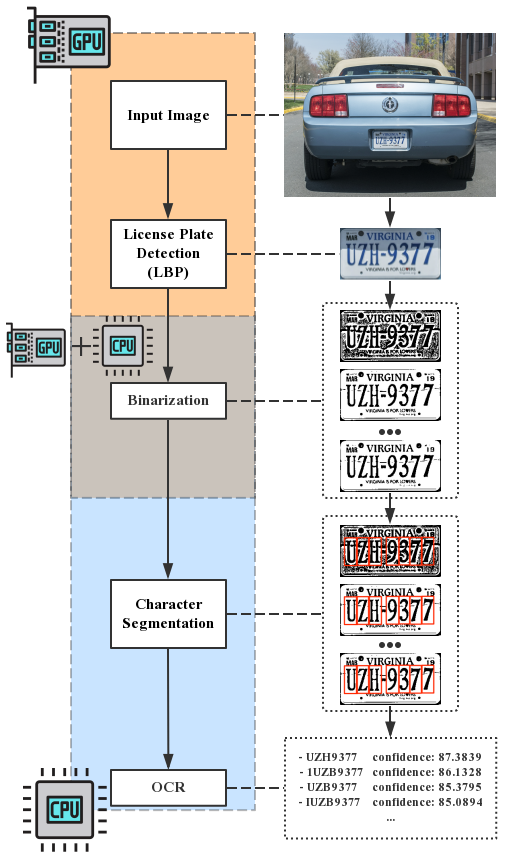
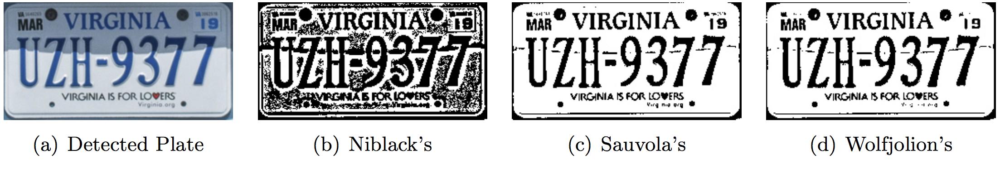
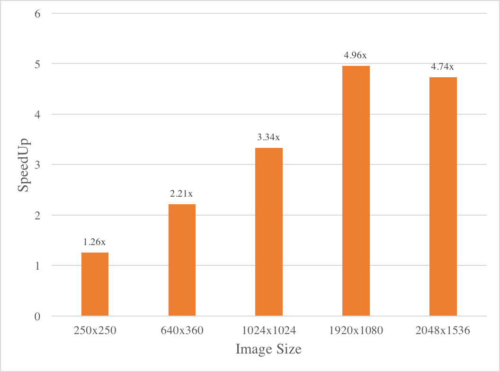
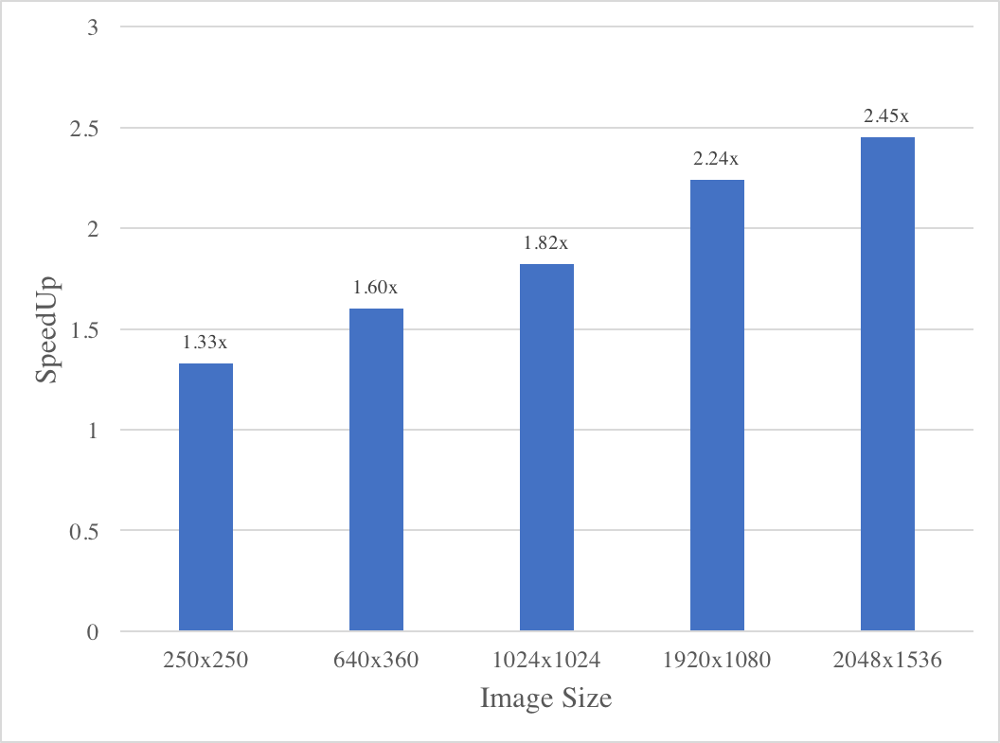
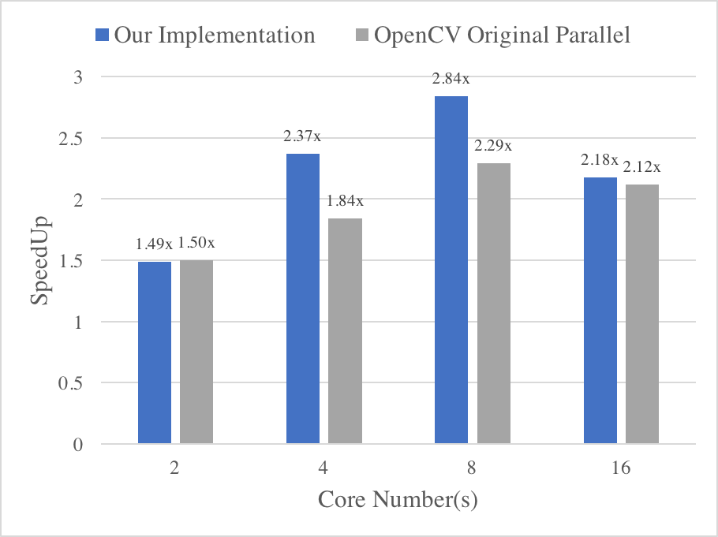
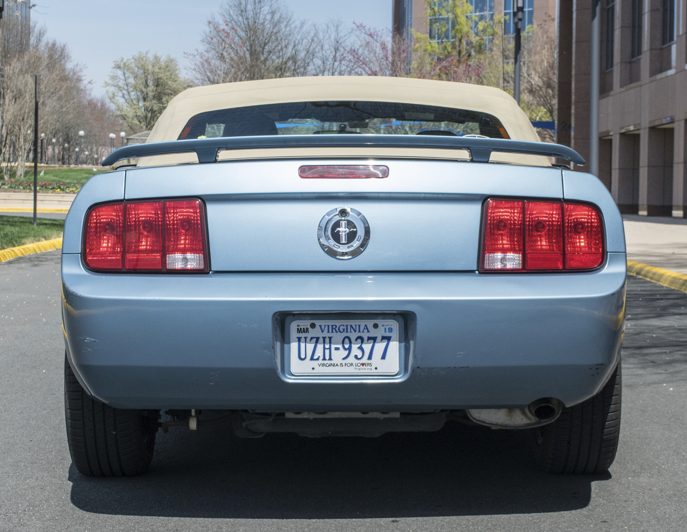
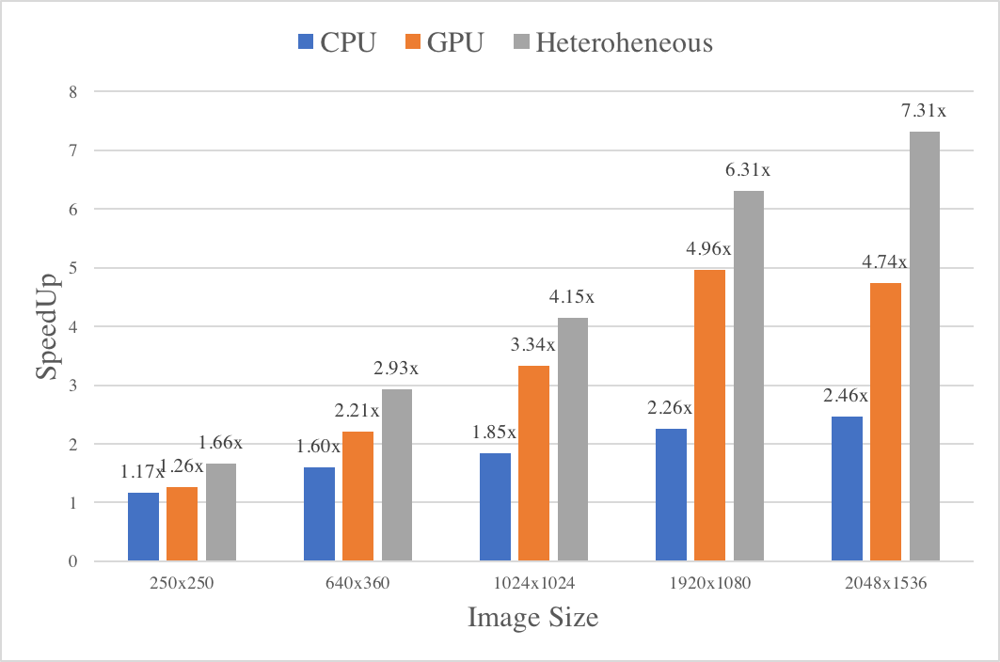

# Summary
We parallelized an existing automatic number plate recognition system in CUDA on GPUs and in OpenMP on multi-core CPUs, compared the performance of two implementations and finally integrated two implementations into one heterogeneous system. Finally, we have achieved on average **1.846×** speedup on multi-core CPUs, **3.3351×** on GPUs, and **4.1527×** on final integrated heterogeneous system (tested on GHC machines). The whole pipeline is shown in Figure 1 below.

<p align="center">

<h4 align="center"> Figure 1. Heterogeneous Parallelized Automatic Number Plate Recognition System </h4>
</p>

# Background
Automatic number plate recognition (ANPR) is a computation intensive and latency critical application as the input is real-time video stream or image, and the immediate output is often required. ANPR system operates as a complicated pipeline, and there are various processing occuring in stages, including license plate detection, plate binarization, character analysis, plate edge detection, de-skew, character segmentation, optical character recognition (OCR), and post processing. There are relative independence among stages and workflow, and most of the time-consuming operations are related to image processing, which makes the whole system very likely to benefit greatly from parallelism. 

There are a number of open source implementations of ANPR, and among them, OpenALPR [1] may be the most popular and well-maintained project. OpenALPR is an an ANPR library written in C++. For this project, We used the existing OpenALPR as the serial start code, and base on it, we focused on parallelizing the system. 

## License Plate Detection (LBP)

This phase uses the Local Binary Pattern (LBP) algorithm to find possible license plate regions (x,y, width, height). Each of these regions is sent to the later pipeline phases for further processing. One example is shown in Figure 2.

LBP is a type of visual descriptor used for classification in computer vision, and is known for being a powerful feature for texture classification [2][5]. The LBP feature vector is the histogram of LBP code which is calculated based on each pixel. The existing implementation uses OpenCV's cascade classification. It applies a trained classfier (e.g. Adaboost) to a region of interest in an input image. To search for the object in the whole image, the search window is moved across the image and every location is checked using the classifier. Obviously, this process is inherently easy to be parallelized - regions of images can be easily mapped to multiple threads or GPU cores and parallelized using OpenMP and CUDA.

The detection phase is regarded as the most processing-intensive phase, and this becomes one of our focused stage to accelerate.

<p align="center">

<h4 align="center"> Figure 2. Example of license plate detection stage </h4>
</p>

## Image Binarization
This phase generates multiple binary images for each plate region. The reason for generating multiple binary images is to achieve better performance in finding all the characters. A single binarized image may result in missed characters if the image is too dark or too light for example. Current implementation of image binarization in OpenALPR supports three different algorithm:  Niblack’s [11], Sauvola's [12], and Wolfjolion's [13]. The three popular algorithms are very similar to each other, and only different in the way to calculate the thresholds that determine the binary value of each pixel. One example is shown in Figure 3.

<p align="center">

<h4 align="center"> Figure 3. Example of plate binarization stage </h4>
</p>

### Niblack's Algorithm
Niblack’s algorithm calculates a pixel-wise threshold by sliding a rectangular window over the grey-scale image. The threshold $T$ is computed by using the mean $m$ and standard deviation $s$, of all the pixels in the window, and is denoted as:

$$ T = m + k*s $$

where $k$ is a constant, which determines how much of the total print object edge is retained, and has a value between $0$ and $1$. The value of $k$ and the size $SW$ of the sliding window define the quality of binarization [6]. Specifically, the threshold for each pixel is decided by the window that uses this pixel as the centre, and if current value of pixel is greater than the threshold, the pixel is set to white, and otherwise it is set to black.

### Sauvola’s Algorithm
Sauvola's algorithm is a modified version of Niblack's, and it is claimed to give improved performance on documents where the background contains light texture, big variations and uneven illumination. In this algorithm, a threshold is computed with the dynamic range of the standard deviation, $R$, using the equation:

$$ T = m * (1 + k (s/R -1)) $$

where $m$ and $s$ are again the mean and standard deviation of the whole window and $k$ is a fixed value.

As shown above, both algorithms are similar to each other. A general and optimized pseudo code for serial implementation is shown in Appendix.

Current OpenALPR implementation uses three different settings (i.e. thresholds) for generating three binarized images for one same input image. We observed that each binarization process is independent from each other which makes it perfect for being parallelized. Also, during each independent binarization process, we observed that current implementation repeatedly computes same image statistics for same input image. This process is time-consuming as in order to compute mean and standard deviation, it has to glide a window across the image and creates two maps.  Obviously, this process is inherently easy to be parallelized.

Additionally, the statistics calculation involves iterating the 2D image in a certain order. This process can be parallelized over multiple threads so that each thread is responsible for several continuous rows/columns of the image. This makes use of data locality and also helps improve performance.

## Character Segmentation
This phase aims at isolating all the characters in the plate image. There are multiple complicated sub-tasks involved in this phase. First, it removes small contours in the binarized image. Then, it calculates the histograms and scores the histogram quality based on number of characters, character volume, and separation. It uses vertical histograms to find gaps between the plate characters. Finally, it removes disconnected and small speckles and disqualifies character regions in order to clean up the character box. This stage can be parallelized either among different thresholds or character regions.

## Optical Character Recognition (OCR)
This phase attempts to analyze each character independently. Given the recognized character line and segmented characters, it recognizes all possible characters and computes their confidences. This process is inherently easy to be parallelized - different character regions and thresholds can be easily mapped to multiple threads or GPU cores and parallelized using OpenMP and CUDA.

Current implementation of OpenALPR uses a third-party library Tesseract to do most of the recognition work, which makes it extremely difficult for us to optimize the pipeline as we have to touch the source code of the library when parallelizing it. 

# Resources
## Starter Code
We started from the existing OpenALPR code and base on it to parallelize the whole system. The existing OpenALPR implementation served as the serial baseline. Besides, OpenALPR utilizes OpenCV function in the plate detection phase. We re-implemented some functions in OpenCV to explore parallelism. 

- OpenALPR: Automatic License Plate Recognition library ([GitHub](https://github.com/openalpr/openalpr)): OpenALPR is an open source Automatic License Plate Recognition library written in C++. This library analyzes images and video streams to identify license plates. The input is an image, various processing occurs in stages, and the output is the possible plate numbers in the image.
- OpenCV: Open Source Computer Vision Library 
    ([Source Code](\href{https://opencv.org/opencv-2-4-9.html)): OpenALPR uses OpenCV 2.4.9 in the plate detection phase for running LBP algorithm.

## Machine
Our testing environment is based on CMU GHC machine (ghc36.ghc.andrew.cmu.edu) which contains eight-core, 3.2 GHz Intel Core i7 processor CPU and 2 GPUs: Quadro K620 and GeForce GTX 1080. Quadro K620 supports CUDA compute capability 5.0 and GeForce GTX 1080 supports CUDA compute capability 6.1.

# Approach
## GPU-based Parallel
Currently, GPUs are welcome by both academia and industry to implement parallel algorithms in various areas such as computer graphics, and scientific computation, as well as computational geometry [7][8][9][10]. Parallel implementations on GPUs have been applied to wide ranged numerical problems to improve the overall performance, and all of them prove the effectiveness of GPUs for dealing with problems of  high arithmetic intensity.

In this project, we chose to use GPU language CUDA (Compute Unified Device Architecture) developed by NVIDIA, as it has similar syntax as C language and has less computational restriction. Other GPU compilers require much background knowledge. CUDA enabled GPUs normally have hundreds of cores and could support thousands of computing threads running in parallel. Each core has shared memory, and this on-chip shared memory allows parallel tasks running on the same cores to share data without sending it over the system memory bus.

CUDA kernel function is the fundamental building block of CUDA programs. When launching a CUDA kernel function, the number of tasks that run this same kernel function needs to be specified. These tasks are organized in a two-level hierarchy, block and grid. Small sets of tightly coupled tasks are grouped into blocks. In a given execution of a CUDA kernel function, all blocks contain the same number of tasks. The tasks in a block run concurrently and can easily communicate with each other using shared memory. This becomes one difficult problem we tried to figure out during this project - how to decompose the problem and distribute tasks so that they could achieve best performance. On the other hand, GPU also supports blocks running at the same time, with no guarantees about their relative execution order. As a result, synchronization between blocks is difficult. Inevitably, this becomes another difficult issue we are dealing with - how to make sure the execution order is as expected.

In the second checkpoint, we aimed at optimizing several chosen stages in the pipeline on GPUs using CUDA. Particularly, we optimized image binarization and plate detection stage. Below is the list of work we completed in the second checkpoint:

- Optimized the image binarization phase by parallelizing the Wolf-Jolien and Sauovola algorithm on GPU using CUDA. The achieved performance improvement depends on the input image size. For the most common input size, it achives around **1.91x** speedup.
- Optimized the plate edge detection phase by parallelizing OpenCV cuda. The achieved performance improvement depends on the input image size. For the most common input size, it achieves around **2.11x** speedup.

### License Plate Detection (LBP)
When running on GPU machines, OpenALPR utilizes OpenCV cv::gpu::CascadeClassifier\_GPU::detectMultiScale function to detect plate regions in the input image. The detectMultiScale function is already implemented by CUDA. However, each of CUDA algorithms in OpenCV can use only one single GPU. Therefore, we re-wrote the code to parallel plate defection stage by distributing the work on multiple GPUs.

Pseudo-code snippet (Algorithm 1) shows the original implementation of detectMultiScale. In this implementation, the detection part (2nd point in the code) is the most processing-intensive part. This part keeps scaling the input image and running LBP algorithm on the scaled image until the scaled image is larger than the predefined maxObjectSize. In our re-implementation, we used maxObjectSize to calculate the loop times in adavance and re-wrote the OpenCV CUDA code to split the loop into multiple equal parts so that they can be distributed on multiple GPUs.

```C
int cv::gpu::CascadeClassifier_GPU::detectMultiScale(...) {
    // 1. copy kernel data to GPU for calculation
    ...
    // 2. detects objects of different sizes in the input image.
    while (scaledImageSize < maxObjectSize) {
        GpuMat scaledImage;
        // 2.1 scaled input image by gpu::resize (implmented by CUDA)
        gpu::resize(image, scaledImage, factor);
        // 2.2 find the candidate rectangles from the scaled image 
        //     by using LBP algorithm (implmented by CUDA)
        lbp::classifyPyramid(....);
        // 2.3 calculate the next scaled factor
        factor *= scaleFactor;
    }
    // 3. copy GPU data back to kernel
    ...
}
```
<p align="center">
<h4 align="center"> Algorithm 1. CUDA-based OpenCV detectMultiScale Original Implementation </h4>
</p>

Pseudo-code snippet (Algorithm 2) shows the idea how we make detectMultiScale function running on multiple GPUs. First, we used OpenMP to create multiple threads, each thread is responsible for setting up one GPU. In our case, we created 2 threads for 2 GPUs. Besides, we revised the detectMultiScale function interface with 3 additional parameter: device\_id, startImgSize, endImgSize. Parameter device\_id identified the current active GPU device. Parameters  startImgSize and endImgSize limit the working loop inside the detectMultiScale function. Instead of calculating the image from the original size to the maxObjectSize, the calculation now only iterate from startImgSize to endImgSize.

After implementing this idea, we make OpenCV detectMultiScale function support multiple GPUs on GHC machine.

```C
// the global variable store the detected plates
vector<Rect> plates; 
// One thread is in charge of one GPU
#pragma omp parallel num_threads(gpu_num)
{
    int tid = omp_get_thread_num();
    
    // split the work into the equal parts
    int startImgSize = ...;
    int endImgSize = ...;
    
    // invoke GPU
    int numdetected = 
        cuda_cascade_vec[tid].detectMultiScale(
                                    tid, startImgSize, endImgSize, ...);
    
    ...
    
    if (numdetected > 0) {
        #pragma omp critical 
	    {
	        // Put GPU detected plates into plates vector
	        for (int i=0; i<numdetected; i++)
		        plates.push_back(..);
	    }
    }
}

// Revised detectMultiScale function for supporting multiple GPUs
int cv::gpu::CascadeClassifier_GPU::detectMultiScale(
                    device_id, startImgSize, endImgSize, ...) {
    // 1. set the active device with the device_id
    gpu::setDevice(device_id);
    // 2. copy kernel data to GPU for calculation
    ...
    // 3. detects objects of different sizes in the input image.
    //    but it just calculates from startImgSize to endImgSize
    while (startImgSize < endImgSize) {
        ...
    }
    // 4. copy GPU data back to kernel
    ...
}
```
<p align="center">
<h4 align="center"> Algorithm 2. CUDA-based OpenCV detectMultiScale Revised Implementation </h4>
</p>

### Image Binarization
Most character recognition approaches are taking advantages of the underlying binarized image information [6]. Compared with 256 levels of image representation, binary data representation could significantly reduce computational overhead and pixel analysis. Current character recognition algorithm is very slow because of the requirement of large memory and computational power. It requires higher implementation performance and needs to enable real time data processing. As a result, computational power reduction and power saving techniques are desirable. Emperical study shows that GPUs could fulfill all the requirement of developing fast OCR systems. Speed, programmability, and price became it more attractive [3][4]. 

The serial algorithm was implemented in C++ together with OpenCV library. In CUDA, it is assumed that both host and device maintain their own DRAM. Host memory is allocated using malloc and device memory is allocated using cudaMalloc. CUDA threads are assigned a unique thread ID that identifies its location within the thread, calculated based on the given block id and grid id. We observed that each pixel in the image is relatively independent from each other - the threshold of it is calculated based on the window that uses it as the centre. This observation indicates that parallel over each pixel would work. Then the first parallel version is based on 2D allocation - each pixel is allocated to a task. The version 1 parallel implementation is shown in the form of pseudo code below.

```C
kernel(intput, output, winx, winy) {
    int x = blockIdx.x * blockDim.x + threadIdx.x;
    int y = blockIdx.y * blockDim.y + threadIdx.y; 
    
    int sum=0, sqrSum=0;
    for(i=y-windowSize to y+windowSize) {
        for(j=x-windowSize to x+windowSize){ 
            int v = input[j, i];
            sum += v; 
            sqrSum += v*v;
        }
    }
    
    // Calculate mean and variance;
    ...
    
    // Calculate threshold based on mean and variance
    // Below is the example of Sauvola's Algorithm
    threshold = m*(1+k*(sd/R-1)); 
    
    if(input[y, x] <= threshold)
        output[y, x] = BLACK; 
    else 
        output[y, x] = = WHITE;
}

wrapper(input, output, k) {
    dim3 dBlock(BLOCKSIZE, BLOCKSIZE);
    dim3 dGrid((width+dBlock.x-1)/dBlock.x, 
        (height+dBlock.y-1)/dBlock.y 
    );
    kernel<<<dGrid, dBlock>>>(
        input, output, windowSize, k
    );
}
```
<p align="center">
<h4 align="center"> Algorithm 3. CUDA-based Binarization Version 1 </h4>
</p>

Then we noticed that the 2D allocation is too fine-grained to make use of computation locality - each time it needs to re-calculate the whole window. Then we tried to use 1D allocation - each task is given a range of rows, and it is responsible for calculating all pixels in these rows (across all columns). This could take advantage of computation locality of the binarization algorithm and also make full use of memory locality. Each time it does not need to re-calculate the whole window when calculating the mean and sum, it only needs to remove the left old column and add the right new column, which could save a significant number of computation. Finally, the performance of our GPU-based parallelized binarization is shown in section 5.

## Multi-core CPU-based Parallel
### License Plate Detection (LBP)
In OpenALPR, it utilizes OpenCV feature-based cascade classifier to detect plate region, and it calls CascadeClassifier::detectMultiScale function to detects objects of different sizes in the input image.

To explore the parallel ability, we re-wrote the code in OpenCV CascadeClassifier::detectMultiScale function by using OpenMP. The pseudo code below shows the original implementation of detectMultiScale. OpenCV has its own cv::parallel\_for\_ framework to to parallelize their code. In detectMultiScale function, OpenCV uses   cv::parallel\_for\_ in detectSingleScale function. It uses the multithread to find the candidate rectangles from the scaled image in parallel. However, the candidate detected in detectSingleScale has to be inserted into a global variable candidates vector. Therefore, OpenCV uses a mutex to deal with this data sharing issue. This would lead to a performance issue that if it has many detected candidates, the overheads of using mutex are nonnegligible. Therefore, we re-implemented this function to solve this problem.

```C
vector<Rect> candidates;
for( double factor = 1; ; factor *= scaleFactor ) {
    // a. scale the image by the factor
    scaleImage = scale(originalImg, factor)
    // b. Assigns an image to feature evaluator.
    featureEvaluator->setImage(scaleImage)
    // c. find the candidate rectangles from the scaled image 
    //    by using LBP algorithm 
    detectSingleScale(FeatureEvaluator, scaledImage, candidates);
}
```
<p align="center">
<h4 align="center"> Algorithm 4. OpenCV detectMultiScale Original Implementation </h4>
</p>

To optimize detectMultiScale, we should find the loop times first. 
There is a predefined parameter maxSize. maxSize indicates the maximum possible object size, objects larger than that are ignored. That is if the scaledImage is larger than maxSize, we can break the for loop. Therefore, we can use maxSize to calculate the loop times.
Pseudo-code snippet (Algorithm 5) shows the idea how we re-implemented to explore the different parallelism strategy. Instead of parallelize detectSingleScale function, we parallelize the outer for loop. Because workload of different scaled images are different, we used the "dynamic" OpenMP scheduling to avoid workload imbalance among threads. 
Besides, we have to handle the data race problem. In our implementation, each thread is in charge of one scaled image. Therefore, in detectSingleScale function, we do not need mutex for data racing problem. Each thread has its own private candidate vector, and thus we only need to merge each private candidate vector at the end of the function. 
According to the pseudo code snippet above, we can see that there are two global data variables: candidate vector ($vector<Rec>$) and feature evaluator ($Ptr<FeatureEvaluator>$). We can use **\#pragma omp critical** to handle the data race of candidates. However, dealing with the data race of featureEvaluator is much more complicated. featureEvaluator is a smart pointer so we have to make deep copies for different thread has its own local featureEvaluator, otherwise the result will be corrupted and cause the segmentation fault.

```C
vector<Rect> candidates;
// calculate how many scaled image should be done
int upperBound = getScaleCount(...);
#pragma omp parallel
{
    ...
    // each thread has its own candidate vector
    vector<Rect> threadCandidates;
    ...
    // 
    #pragma omp for schedule(dynamic)
    for (int i=0; i<upperBound; i++) {
        ...
        // Instead of passing the shared candidates vector, 
        // we pass the thread local candidates vector here to
        // reduce the overhead of mutex
        detectSingleScale(..., threadCandidates);
    }
    
    // Put detected plates into plates vector
    if (threadCandidates.size() > 0) {
        #pragma omp critical
        candidates.insert(...);
    }
}
```

<p align="center">
<h4 align="center"> Algorithm 5. OpenCV detectMultiScale Revised Implementation </h4>
</p>

### Image Binarization
Current OpenALPR implementation uses three different settings (i.e. thresholds) for generating three binarized images for one same input image. We observed that each binarization process is independent from each other which makes it perfect for being parallelized. Also, during each independent binarization process, we observed that current implementation repeatedly computes same image statistics for same input image. This process is time-consuming as in order to compute mean and standard deviation, it has to glide a window across the image and creates two maps. We re-wrote the code so that these statistics can be reused for three binarization processes without re-calculating them every time. 

Additionally, the statistics calculation involves iterating the 2D image in a certain order. This process is parallelized over multiple threads so that each thread is responsible for several continuous rows/columns of the image. This makes use of data locality and also helps improve performance.

### Character Segmentation
As mentioned above, there are multiple complicated sub-tasks involved in this phase. At the beginning, we attempted to optimize each stage carefully - either parallel among different thresholds or character regions. However, it turns out that fine-grained parallel does not help improve performance but makes the whole phase slower than serial instead. We investigated into this and made a detailed timing analysis of each function as shown in Table 1, and noticed that some tasks take very little time, which makes the overheads of creating threads outperforms the performance improvement of multi-thread. 

|                             | Time (ms) |
|-----------------------------|-----------|
| Remove small contours       | 0.307155  |
| Create and score histograms | 0.874186  |
| Filter edge boxes           | 0.301344  |
| Combine close boxes         | 0.118482  |
| Filter mostly empty boxes   | 0.497484  |
| Clean character regions     | 0.199541  |
| Apply the edge mask         | 0.005423  |

<p align="center">
<h4 align="center"> Table 1. Time analysis of character segmentation of baseline </h4>
</p>

Based on this observation, we selected several relatively time-consuming tasks and parallelized them, and finally achieved around **1.36** performance improvement.

### Optical Character Recognition (OCR)
As mentioned above, current implementation of OpenALPR uses a third-party library Tesseract to do most of the recognition work, which makes it extremely difficult for us to optimize the pipeline as we have to touch the source code of the library when parallelizing it. For now we only parallelize the pipeline over different thresholds and this gives us around **2.52** performance improvement.

## Integrated Heterogeneous Parallel
After separately parallelizing the system on different platforms (i.e. GPUs and multi-core CPUs), we observed that different process stages benefit differently from different platforms. In order to use the most efficient platform for each component in the system, we decided to make a heterogeneous mixture of resources (i.e. mixture use of both GPUs and multi-core CPUs). Based on careful analysis of the performance gain of each stage (as shown in section 5) and characteristics of various workloads, we observed that license plate detection and image binarization benefit better from GPU-based parallelism. In this case, in our final integrated heterogeneous system, the aforementioned two stages are parallelized on GPUs, and character segmentation and OCR stages are parallelized on multi-core CPUs. Especially, for image binarization stage, each single binarization process is parallelized on GPUs and different binarized images of different thresholds are parallelized on multi-core CPUs.

# Results and Analysis
This section gives thorough evaluation of the parallelized system. The performance scale between original serial implementation and multi-core CPU-based parallel, GPU-based parallel, final integrated hetergeneous parallel are compared.

## GPU-based Parallel
Table 2 and Figure 4 shows the execution time of the serial OpenALPR and our GPU-based parallellized implementation. Generally, the larger the input image size is, the better speedup the parallel can achieve. For example, when the input size is $1024*1024$, our GPU-based parallelized OpenALPR can achieve **3.34** speedup. The detailed analysis of stage are implemented in CUDA will be illustrated in section 5.1.1 and 5.1.2.

| Image Size | Serial Time | GPU Parallel Time | SpeedUp |
|------------|-------------|-------------------|---------|
| 250*250    | 40.6330     | 32.3489           | 1.26    |
| 640*360    | 83.0965     | 37.5372           | 2.21    |
| 1024*1024  | 158.3030    | 47.4653           | 3.34    |
| 1920*1080  | 255.6730    | 51.5589           | 4.96    |
| 2048*1536  | 331.0080    | 69.8969           | 4.74    |

<p align="center">
<h4 align="center"> Table 2. Execution time of pipeline with various image sizes using GPUs on GHC Machine </h4>
</p>

<p align="center">

<h4 align="center"> Figure 4. Histogram of speedup of GPU-based parallel on GHC Machine </h4>
</p>

### License Plate Detection (LBP)
Table 3 and Table 4 show the execution time of plate detection stage on different GPUs with various input image sizes. It can be seen that execution time of different GPUs with same CUDA implementation is significantly different. GeForce GTX 1080 which has higher computing capability of $6.1$ performs much better than Quadro K620 which has lower compute capability $5.0$. Besides, we can see that the larger the input image is, the longer the plate detection time takes. This can be explained by the fact that LBP algorithm exams every pixel in the image to detect the plate so the execution time should be proportional to the image size. 

| Image Size         | 250*250 | 640*360 | 1024*1024 | 1920*1080 | 2048*1536 |
|--------------------|---------|---------|-----------|-----------|-----------|
| Kernel Data to GPU | 0.425   | 0.666   | 0.713     | 0.802     | 0.830     |
| Plate Detection    | 1.816   | 3.304   | 4.822     | 6.049     | 8.489     |
| GPU Data to Kernel | 0.028   | 0.020   | 0.012     | 0.028     | 0.028     |
| Total Time         | 2.421   | 4.142   | 5.846     | 7.136     | 9.630     |

<p align="center">
<h4 align="center"> Table 3. Time analysis of serial Plate Detection on GeForce GTX 1080 </h4>
</p>

| Image Size         | 250*250 | 640*360 | 1024*1024 | 1920*1080 | 2048*1536 |
|--------------------|---------|---------|-----------|-----------|-----------|
| Kernel Data to GPU | 0.600   | 0.742   | 0.861     | 0.880     | 0.914     |
| Plate Detection    | 3.660   | 8.193   | 21.268    | 28.183    | 39.584    |
| GPU Data to Kernel | 0.038   | 0.237   | 0.016     | 0.040     | 0.038     |
| Total Time         | 4.495   | 9.134   | 22.944    | 29.647    | 41.2049   |

<p align="center">
<h4 align="center"> Table 4. Time analysis of serial Plate Detection on Quadro K620 </h4>
</p>

Table 5 shows the execution time of paralleized plate detection on these two GPUs. Because we distribute the plate detection work into two equal parts on each GPU, the execution time on each GPU is reduced. However, the data passing overhead is increased. Besides, because we have to combine the results from both two GPUs to get the final output, the faster GPU has to wait for the slower GPU to finish its job. Therefore, when comparing the paralleized version running on two GPUs to the version running solely on GeForce GTX 1080, two GPUs do not bring any advantage. However, if we compare the paralleized version running on two GPUs to the version running solely on Quadro K620, we can get at most **4.1** speedup. 

| Image Size                 | 250*250 | 640*360 | 1024*1024 | 1920*1080 | 2048*1536 |
|----------------------------|---------|---------|-----------|-----------|-----------|
| Kernel Data to GPU         | 1.047   | 1.547   | 2.355     | 1.848     | 3.379     |
| Plate Detection            | 3.180   | 3.440   | 5.226     | 5.914     | 9.107     |
| GPU Data to Kernel         | 0.023   | 0.023   | 0.022     | 0.023     | 0.027     |
| Total Time                 | 4.372   | 5.039   | 7.819     | 9.039     | 10.056    |
| SpeedUp - GeForce GTX 1080 | 0.55    | 0.82    | 0.75      | 0.79      | 0.96      |
| SpeedUp - Quadro K620      | 1.03    | 1.81    | 2.93      | 3.28      | 4.10      |

<p align="center">
<h4 align="center"> Table 5. Time analysis of paralleized Plate Detection on 2 GPUs </h4>
</p>

### Binarization
The performance of our GPU-based parallelized binarization algorithm is shown Table 6 (time is in ms). It is tested independently from the OpenALPR pipeline.

| Image Size | Serial (CPU) | GPU Parallel | Speedup |
|------------|--------------|--------------|---------|
| 50*50      | 0.29317      | 0.56441      | N.A.    |
| 100*100    | 1.31062      | 0.911923     | 1.4372  |
| 200*100    | 2.31622      | 1.31426      | 1.7624  |
| 250*250    | 7.30358      | 1.52826      | 4.7790  |
| 400*400    | 18.5273      | 2.28661      | 8.1025  |
| 500*500    | 27.6458      | 2.74863      | 10.0580 |
| 640*640    | 44.141       | 3.49484      | 12.6303 |
| 800*800    | 66.319       | 4.41877      | 15.0085 |
| 1024*1024  | 159.535      | 5.58864      | 28.5463 |

<p align="center">
<h4 align="center"> Table 6. Performance scale of GPU-based parallelized binarization </h4>
</p>

It is observed that the performance gain is increased as the image size increases. When the input image size is small, it is observed that the performance on GPUs is worse than that on CPUs. This can be explained by the fact that the overheads of GPUs dominate the performance when the input image is small. To address this problem, we manually set a threshold to be 50x50 in our system - when the input image is larger than the threshold, it is binarized on GPUs, and otherwise, it is binarized on CPUs. This adaptive strategy allows for best utilizing the computing resources, and achieving best performance on a heterogeneous platforms.

The performance of the binarization stage integrated with the GPU-based parallelized algorithm is shown in Table 7. It can be seen that GPU-based parallelism of binarization achieves satisfying performance improvement. To be noted, we manually disabled the original OpenALPR default behaviour of resizing plate image to 100x100 to demonstrate the improvement in parallelizing the algorithm. Similarly, the performance gain on GPUs increases as the plate size increases.

| Image Size | Plate Size | Serial (CPU) | GPU Parallel | Speedup |
|------------|------------|--------------|--------------|---------|
| 1024*1024  | 145*80     | 9.58136      | 5.50162      | 1.7416  |
| 635*358    | 275*137    | 11.1002      | 5.82675      | 1.9050  |
| 640*360    | 346*172    | 18.4288      | 7.07536      | 2.6046  |
| 1920*1080  | 422*211    | 28.3619      | 8.67747      | 3.2685  |
| 576*417    | 422*211    | 30.9555      | 8.85483      | 3.4959  |
| 1600*1200  | 1005*501   | 165.884      | 19.3882      | 8.5559  |
| 2048*1536  | 1226*612   | 232.121      | 23.5575      | 9.8534  |
| 1920*1080  | 1441*719   | 343.44       | 28.358       | 12.1109 |
| 4288*2848  | 3090*1545  | 2005.18      | 64.8942      | 30.8992 |

<p align="center">
<h4 align="center"> Table 7. Performance scale of GPU-based parallelized binarization integrated into OpenALPR pipeline </h4>
</p>

## Multi-core CPU-based Parallel
For multi-core CPU parallel, the stages that are optimized are plate detection, character analysis, and character segmentation. We also optimized the binarization phase which is used in character analysis and character segmentation stage.

In our experiment, we use 8 threads for parallel the pipeline. The detailed performance analysis of the existing baseline as well as the comparison between the serial and multi-core CPU-based parallel are shown in Table 8, Table 9, and Figure 6.

According to our experiment results, we can see that the larger the image size, the better speed up we can get. This is very reasonable result, because the larger the image size, the more pixels need to be computed in plate detection phase which is the most processing-intensive phase.  

| Image Size              | 250*250  | 640*360  | 1024*1024 | 1920*1080 | 2048*1536 |
|-------------------------|----------|----------|-----------|-----------|-----------|
| Plate Detection         | 21.9735  | 58.1779  | 124.406   | 220.699   | 294.364   |
| Character Analysis      | 3.62713  | 4.12122  | 3.72858   | 3.79446   | 2.73438   |
| High Contrast Detection | 0.06634  | 0.078905 | 0.066706  | 0.067157  | 0.067603  |
| Plate Binarization      | 3.18626  | 2.15722  | 2.22813   | 2.03205   | 3.43194   |
| Character Segmenter     | 1.72527  | 2.24373  | 1.96545   | 2.14219   | 1.66145   |
| OCR                     | 17.4161  | 15.229   | 17.541    | 13.2013   | 12.7826   |
| Post Process            | 0.275428 | 0.292114 | 0.278398  | 0.531998  | 0.314322  |
| Total Time              | 46.2567  | 83.0965  | 156.472   | 252.919   | 329.784   |

<p align="center">
<h4 align="center"> Table 8. Time analysis of serial pipeline on GHC machine </h4>
</p>

| Image Size              | 250*250  | 640*360  | 1024*1024 | 1920*1080 | 2048*1536 |
|-------------------------|----------|----------|-----------|-----------|-----------|
| Plate Detection         | 6.21241  | 25.6321  | 59.4414   | 75.9764   | 93.8333   |
| Character Analysis      | 2.37714  | 1.67146  | 1.52745   | 1.96901   | 1.50437   |
| High Contrast Detection | 0.082073 | 0.06728  | 0.067034  | 0.06928   | 0.109388  |
| Plate Binarization      | 1.90118  | 1.91884  | 1.44203   | 2.02298   | 1.71746   |
| Character Segmenter     | 2.32574  | 2.71017  | 1.67172   | 2.69635   | 2.15744   |
| OCR                     | 16.6108  | 14.3622  | 11.869    | 16.1474   | 14.8165   |
| Post Process            | 0.347173 | 0.300128 | 0.224961  | 0.554237  | 0.648393  |
| Total Time              | 34.7562  | 51.9774  | 85.7526   | 113.157   | 134.499   |
| Speedup                 | 1.33     | 1.60     | 1.82      | 2.24      | 2.45      |

<p align="center">
<h4 align="center"> Table 9. Time analysis of multi-core CPU-based parallelized pipeline on GHC machine </h4>
</p>

<p align="center">

<h4 align="center"> Figure 5. Speedup of Multi-core CPU-based parallelized pipeline on GHC machine</h4>
</p>

### Plate Detection
As mentioned in Section 4.2.1, OpenCV has its own parallel framework, and we re-implement OpenCV function to explore the different parallelism strategy. According to the pseudo-code snippets Algorithm 1 and Algorithm 2, the original OpenCV parallelizes the inner loop (detectSingleScale function) and our implementation parallelizes the outer loop. If the image has few detected rectangle candidates, the original OpenCV parallelism framework may perform better than our implementation. However, since each time a thread detects a candidate, the original implementation uses the mutex to lock the global variable to insert the candidate to the result vector, our implementation can perform much better if the input image has more detected rectangle. Another factor that affects performance is the imbalanced workload. In the detectMultiScale function, each image will be scaled for multiple times depending on its original size and max object size (but this size is fixed in our implementation). If the scaling times is not the multiple times of the number of cores (number of threads), our implementation may have imbalanced workload and thus have poor parallelism performance.

Table 10 shows the execution time of original OpenCV parallel implementation, and Table 12 shows the execution time of our parallel implementation. if the input image (640*360, 1024*1024, and 1920*1080) has more detected rectangles, our implementation performs better than the OpenCV original. Both parallel implementation get worse performance on 16 cores than 8 cores, this can be explained by the work imbalance.

Figure 6 shows the speedup comparison of our implementation with original OpenCV when input size is 640*360. In this case, our implementation gets better performance than original OpenCV. Besides, according to Table 12, our implementation achieves the best performance when using 8 threads.

| Input Size | Serial  | 2 threads | 4 threads | 8 threads | 16 threads |
|------------|---------|-----------|-----------|-----------|------------|
| 250*250    | 11.735  | 10.0804   | 9.47993   | 9.82555   | 12.9199    |
| 640*360    | 59.5612 | 39.6008   | 32.2921   | 26.0132   | 28.0642    |
| 1024*1024  | 158.589 | 101.727   | 69.5448   | 47.749    | 50.9381    |
| 1920*1080  | 255.119 | 149.562   | 99.148    | 68.549    | 67.945     |
| 2048*1536  | 307.974 | 181.213   | 127.021   | 87.6617   | 90.3163    |

<p align="center">
<h4 align="center"> Table 10. Time analysis of parallelized plate detection using original OpenCV implementation </h4>
</p>

| Input Size | Serial  | 2 cores | 4 cores | 8 cores | 16 cores |
|------------|---------|---------|---------|---------|----------|
| 250*250    | 11.735  | 16.114  | 10.053  | 9.958   | 15.947   |
| 640*360    | 59.5612 | 39.858  | 25.135  | 20.988  | 27.350   |
| 1024*1024  | 158.589 | 97.939  | 64.865  | 55.625  | 63.070   |
| 1920*1080  | 255.119 | 141.989 | 90.504  | 68.964  | 99.743   |
| 2048*1536  | 307.974 | 182.418 | 114.386 | 102.827 | 109.474  |

<p align="center">
<h4 align="center"> Table 11. Time analysis of parallelized plate detection using our implementation</h4>
</p>

<p align="center">

<h4 align="center"> Figure 6. Speedup comparison of multi-core CPU-based parallelized plate detection on GHC machine</h4>
</p>

Another advantage of our implementation is that we use the local candidate vector for each thread to store the intermediate result when doing the LBP algorithm. Therefore, it may improve performance by better utilizing data locality. We used Perf tool to measure our cache missed rate which is smaller than the serial implementation. Table 12 shows Perf cache miss rate measurement, which demonstrates that our multi-core CPU-based parallel uses memory more efficiently than original serial implementation.

| Input Size | OpenCV Original Parallel | Our Implementation |
|------------|--------------------------|--------------------|
| 250*250    | 16.663                   | 13.817             |
| 640*360    | 13.510                   | 14.010             |
| 1024*1024  | 15.091                   | 14.587             |
| 1920*1080  | 17.451                   | 15.415             |
| 2048*1536  | 17.895                   | 16.014             |

<p align="center">
<h4 align="center"> Table 12. Cache miss rate comparison of plate detection on GHC machine (8 threads)</h4>
</p>

## Integrated Heterogeneous Parallel
As explained above, the integrated heterogeneous system uses preferred processor for each stage. The performance comparison between original serial, multi-core CPU-based parallel, GPU-based parallel and final integrated heterogeneous is shown below . The evaluation is based on the whole end-to-end pipeline, where the input are images of various sizes, and the output is the predictions of the recognized plate number. One example input image is show in Figure 7.

<p align="center">

<h4 align="center"> Figure 7. Example image input to the pipeline</h4>
</p> 

It can be shown from Table 13, Table 14 and Figure 8 that GPU-based parallelism gives better performance improvement over multi-core CPU-based parallelism, and the final integrated heterogeneous system gives best performance improvement. Finally, our heterogeneous parallelized system gives **4.1527x** speedup compared with the original serial OpenALPR implementation.

| Input Size | CPU Serial | CPU Parallel | GPU Parallel | Heterogeneous |
|------------|------------|--------------|--------------|---------------|
| 250*250    | 40.6330    | 34.7562      | 32.3489      | 24.4316       |
| 640*360    | 83.0965    | 51.9774      | 37.5372      | 28.3947       |
| 1024*1024  | 158.3030   | 85.7526      | 47.4653      | 38.1202       |
| 1920*1080  | 255.6730   | 113.1570     | 51.5589      | 40.4892       |
| 2048*1536  | 331.0080   | 134.4990     | 69.8969      | 45.2732       |

<p align="center">
<h4 align="center"> Table 13. Execution time of pipeline with various image sizes on various platforms (ms)</h4>
</p>

| Input Size | CPU Parallel | GPU Parallel | Heterogeneous |
|------------|--------------|--------------|---------------|
| 250*250    | 1.1691       | 1.2561       | 1.6631        |
| 640*360    | 1.5987       | 2.2137       | 2.9265        |
| 1024*1024  | 1.8460       | 3.3351       | 4.1527        |
| 1920*1080  | 2.2595       | 4.9589       | 6.3146        |
| 2048*1536  | 2.4610       | 4.7357       | 7.3113        |

<p align="center">
<h4 align="center"> Table 14. Speedup of the whole pipeline with various image sizes on various platforms</h4>
<p align="center"> 1024*1024 is the most common input size for the pipeline and thus 4.1527x is regarded as the final performance gain of our parallelism. </p>
</p>

<p align="center">

<h4 align="center"> Figure 8. Histogram of SpeedUp of the whole pipeline with various image sizes on various platforms</h4>
</p> 

It can be shown from Table 13, Table 14 and Figure 8 that GPU-based parallelism gives better performance improvement over multi-core CPU-based parallelism, and the final integrated heterogeneous system gives best performance improvement. Finally, our heterogeneous parallelized system gives **4.1527x** speedup compared with the original serial OpenALPR implementation.

# Issues
Overheads of CUDA runtime initialization: One potential issue we observed when using CUDA-based GPU to accelerate the process is that the overheads of CUDA runtime initialization is significant. It takes around 600ms to create the context for each session. Since CUDA uses lazy-initialization strategy, it only creates the context when the first CUDA function call. In order to hide this overhead, at the start of the application, we insert a cudaFree(0) function call to manually trigger the CUDA runtime initialization. This could help absorb the entire startup cost of context creation. 

# Future Work
One future direction is to look at Tesseract library which is used by current OpenALPR to recognize characters. Current OCR phase is heavily dependent on the third-party library Tesseract, and this makes it extremely difficult for us to parallelize the pipeline. We attempted to recognize each segmented character region in parallel, but it fails as the shared Tesseract recognizer is not thread-safe, and it has internal states, which will result in data corruption in multi-thread situation. We also tried to initialize one independent Tesseract recognizer for each character region, but it turns out the initialization of Tesseract recognizer is very costly.

# References
1] O p en a lp r: A u to m a tic licen se p la te reco g n itio n lib ra ry. https://github.com/openalpr/openalpr, 2018. 

[2] Timo Ahonen, Ab denour Hadid, and Matti Pietikainen. Face description with lo cal binary patterns: Application to face recognition. IEEE Transactions on Pattern Analysis & Machine Intel ligence, (12): 2037{2041, 2006. 

[3] Randima Fernando and Mark J Kilgard. The Cg Tutorial: The definitive guide to programmable real-time graphics. Addison-Wesley Longman Publishing Co., Inc., 2003.

[4] James Fung and Steve Mann. Openvidia: parallel gpu computer vision. In Proceedings of the 13th annual ACM international conference on Multimedia, pages 849–852. ACM, 2005.

[5] Abdenour Hadid, Matti Pietikainen, and Timo Ahonen. A discriminative feature space for detecting and recognizing faces. In Proceedings of the 2004 IEEE Computer Society Conference on Computer Vision and Pattern Recognition, 2004. CVPR 2004., volume 2, pages II–II. IEEE, 2004.

[6] Jingyu He, QDM Do, Andy C Downton, and JinHyung Kim. A comparison of binarization methods for historical archive documents. In Eighth International Conference on Document Analysis and Recognition (ICDAR’05), pages 538–542. IEEE, 2005.

[7] Jens Kru ̈ger and Ru ̈diger Westermann. Linear algebra operators for gpu implementation of numerical algorithms. In ACM Transactions on Graphics (TOG), volume 22, pages 908–916. ACM, 2003.

[8] Julien Mairal, Renaud Keriven, and Alexandre Chariot. Fast and efficient dense variational stereo on gpu. In Third International Symposium on 3D Data Processing, Visualization, and Transmission (3DPVT’06), pages 97–104. IEEE, 2006.

[9] Dinesh Manocha. Interactive geometric and scientific computations using graphics hardware. SIG-GRAPH Course Notes, 11, 2003.

[10] Kenneth Moreland and Edward Angel. The fft on a gpu. In Proceedings of the ACM SIGGRAPH/EU-
ROGRAPHICS conference on Graphics hardware, pages 112–119. Eurographics Association, 2003.

[11] Wayne Niblack. An Introduction to Digital Image Processing. Strandberg Publishing Company,
Birkeroed, Denmark, Denmark, 1985. ISBN 87-872-0055-4.

[12] Jaakko Sauvola and Matti Pietika ̈inen. Adaptive document image binarization. Pattern recognition, 33 (2):225–236, 2000.

[13] C. Wolf, J.-M. Jolion, and F. Chassaing. Text Localization, Enhancement and Binarization in Multimedia Documents. In Proceedings of the International Conference on Pattern Recognition, volume 2, pages 1037–1040, 2002.